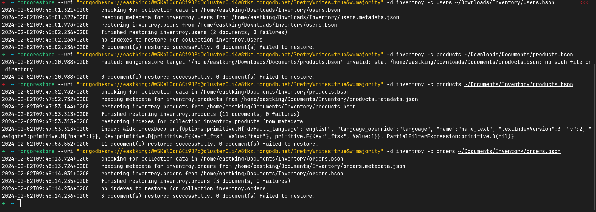

# Lab 2 Solution

## Inventory DB

### Import



### Number of products per category

```js
db.products.aggregate([
{
    $group:
    {
        _id: "$category",
        numberOfProducts: {
            $count: {}
        }
    }
}
])
```


### Max Category Products Price

```js
db.products.aggregate([
{
    $group:
    {
        _id: "$category",
        maxProductPrice: {
            $max: "$price"
        }
    }
}
])

```


### User Ahmed Orders populated with products

```js
db.users.aggregate([
{
    $match: {
        name: {
            $eq: "ahmed"
        }
    }
},
{
    $lookup: {
        from: "orders",
        localField: "_id",
        foreignField: "userId",
        as: "orders"
    }
},
{
    $lookup: {
        from: "products",
        localField: "orders.productsIds",
        foreignField: "_id",
        as: "OrderProducts"
    }
},
    
])
```


## User Ahmed Highest order price

```js
db.users.aggregate([
    {
        $match: {
            name: "ahmed"
        }
    },
    {
        $lookup: {
            from: "orders",
            localField: "_id",
            foreignField: "userId",
            as: "orders"
        }
    },
    {
        $unwind: "$orders"
    },
    {
        $lookup: {
            from: "products",
            localField: "orders.productsIds",
            foreignField: "_id",
            as: "orderProducts"
        }
    },
    {
        $unwind: "$orderProducts"
    },
    {
        $group: {
            _id: {
                userId: "$_id",
                orderId: "$orders._id"
            },
            totalPrice: {
                $sum: {
                    $multiply: ["$orderProducts.price", "$orderProducts.quantity"]
                }
            }
        }
    },
    {
        $group: {
            _id: "$_id.userId",
            maxOrderPrice: { $max: "$totalPrice" }
        }
    }
])

```


## Books.json

### 1st Query

```js
db.books.aggregate([
{
    $match: {
        pageCount: {$gt: 0},
        publishedDate: {
            $gte: ISODate("2010-01-01T00:00:00.000Z"),
            $lte: ISODate("2010-12-31T00:00:00.000Z")
        }
    }
},
{
     $sort: {pageCount: -1}
},
{
    $unwind: "$authors"
},
{
    $match: { authors: "Tariq Ahmed"}
},
{
$count: "BooksPublishedByAhmedTarekIn2010Count"
}
])
```


### 2nd Query

```js
db.books.aggregate([
{
    $unwind: "$authors"
},
{
    $group: {
        _id: "$authors",
        name: {
            $first: "$authors"
        },
        booksPublishedCount: {$count: {}}
    }
},
{
    $project: { _id: false}
}
])
```


